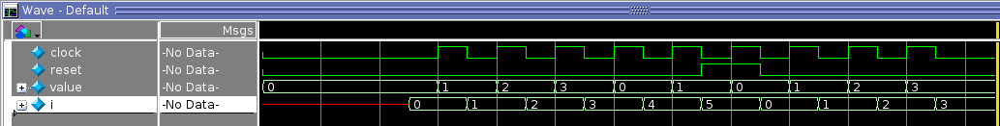
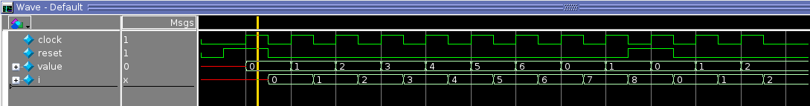
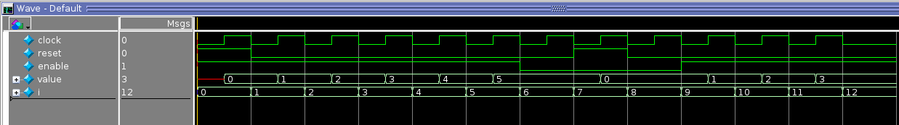
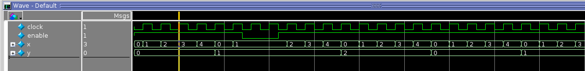

# Lab 3a: Projeto Sequencial - Contadores

<p align="center">
Prof. João Carlos Bittencourt
</p>
<p align="center">
Monitor: Éverton Gomes dos Santos</p>
<p align="center">
Centro de Ciências Exatas e Tecnológicas
</p>
<p align="center">
Universidade Federal do Recôncavo da Bahia, Cruz das Almas
</p>

## Introdução

Este laboratório consiste de várias etapas, cada qual construída com base na anterior. Ao longo do roteiro serão fornecidas instruções e capturas de tela referentes às respectivas etapas. Apesar de termos fornecidos a você quase todo o código SystemVerilog, partes deles foram sublimadas de propósito -- Nesses casos, sua tarefa será completar e testar seu código com bastante cuidado.

Nesta atividade prática, você aprenderá:

- Como especificar circuitos sequenciais em SystemVerilog;
- Estratégias diferentes para desenvolvimento de contadores;
- Incluir funcionalidades de _reset_ síncrono;
- Como incluir funcionalidades de _start/stop_ para controlar seus contadores;
- Como trabalhar com _test bench_ para simulação de clocks em SystemVerilog;
- Alguns construtores novos em SystemVerilog;

## Leitura

Caso tenha dificuldade nos assuntos referentes à lógica sequencial, segue abaixo uma lista de seções relevantes do livro texto Digital Design and Computer Architecture (David & Sarah Harris).

- **Seções 3.2.3 -- 3.2.6**: Flip-flops e Registradores
- **Seções 4.4.1 -- 4.4.3**: Verilog para Flip-flops e Registradores
- **Seção 5.4.1**: Contadores

Antes de seguir com o laboratório, é recomendado ainda que você realize o [Tutorial de Simulação Utilizando o ModelSim](https://github.com/GCET231/tutorial3-simulacao-hdl/tree/main/ModelSim), uma vez que os procedimentos à seguir não envolvem síntese do circuito no Quartus Prime. Com isso, as simulações podem ser realizadas diretamente no ModelSim.

## Contador Módulo-4

Vamos começar nossos trabalhos projetando um contador módulo-4 (**mod-4**). Ou seja, um circuito digital que conta de acordo com a sequência: \(0, 1, 2, 3, 0, 1, 2, 3, 0, ...).

O módulo contador precisará de um registrador de 2-bits para armazenar o valor atual, uma entrada de _clock_ para controlar a atualização do contador, e uma entrada de _reset_ para redefinir o contador para (0), de forma síncrona.

Todas as mudanças no valor do contador -- sejam elas contando ou redefinindo -- devem ser realizada durante a transição da **borda ascendente** do sinal de _clock_.

Use o código à seguir para projetar o contador:

```systemverilog
`timescale 1ns / 1ps
`default_nettype none

module countermod4 (
	input  wire 		 clock,
	input  wire 		 reset,
	output logic [1:0] value = 2'b00
);

   always @(posedge clock)
	begin : mod4_counter
		value <= reset ? 2'b00 : (value + 1'b1);
	end

endmodule
```

O código acima utiliza um construtor que não está presente no padrão Verilog, mas estão no SystemVerilog, associado a um novo tipo de dado denominado `logic`. Portanto, quando você criar um novo arquivo de projeto, **garanta que ele é do tipo SystemVerilog**. Nomeie seu novo arquivo como `countermod4.sv`.

Note o seguinte:

- A primeira linha determina as unidades de tempo para todos os atrasos (semelhante ao que definimos no _test bench_) como nanosegundos com resolução de picossegundos. A segunda linha diz para o compilador para _não_ assumir que sinais não declarados são do tipo padrão `wire`. Ao suprimir o valor padrão, nós estamos forçando que sinais não declarados disparem erros de compilação. Isso ajuda a identificar vários erros de código e _será muito útil!_ **Utilize essa diretiva em qualquer projeto que dizer a partir de agora!**
- As entradas são declaradas como do tipo `wire` (uma vez que elas estão simplesmente vindo de um módulo externo), mas a saída aqui é do tipo `logic`, e não do tipo `wire`. O tipo `logic` é único da SystemVerilog, e representa diferentes tipos de implementações estruturais, dependendo da descrição do circuito. Especificamente, uma variável do tipo `logic` será mapeado para `wire` se sua descrição indicar uma função combinacional. Por outro lado, uma variável do tipo `logic` resultará em um _flip-flop_ sendo instanciado se sua descrição indicar a necessidade de um elemento de estado ou memória. Portanto, o tipo `logic` é usado para indicar que uma variável _pode_ (mas não necessariamente) precisa de _flip-flops_ em sua implementação.
<!-- - O comando `always_ff` é um novo tipo de construtor de atribuição não-contínua da linguagem SystemVerilog. Ele é usado para determinar como o valor de um _flip-flop_ (registrador) deve ser atualizado. No exemplo acima, dizemos que sempre que houver uma borda positiva do clock (`always_ff@(posedge clock)`), `value` é atualizado para `value + 1` (se estiver contando) ou `0` (se acionado o sinal de `reset`). Deste modo, uma vez que `value` é atualizado dentro da atribuição não-contínua `always_ff`, ela irá implementar uma lógica sequencial usando _flip-flops_, ao invés de lógica combinacional, visto que o `value` é atualizado somente entre os pulsos periódicos do _clock_. -->
- No código acima, o operador de atribuição utiliza a chamada atribuição **não-bloqueante**, representado pelo símbolo `<=`. Não confunda com a operação "menor que ou igual"! Considere este símbolo como uma seta para a esquerda.
- Por ser declarado como um vetor de 2-bits, o sinal `value` retornará para `0` ao incrementar o somador, quando `value` for igual a `3`.

Para testar o código acima, utilize o _test bench_ fornecido junto com os arquivos de laboratório, dentro da pasta `sim` (`countermod4_tb_.sv`). Essa rotina de teste realiza o seguinte fluxo de operações:

- Aguarda 5 ns;
- Inicializa o _clock_ (borda positiva em 6 ns, com período de 2 ns);
- Simula o contador por 5 pulsos de clock;
- Aciona o sinal de _reset_ para redefinir o contador de volta para 0; e
- Libera o contador por mais 3 pulsos de clock;

Certifique-se de ter analisado o _test bench_, linha por linha, e entenda o que cada comando faz! Se você formatar as formas de onda de modo a visualizar os sinais em decimal, você deve visualizar a representação exatamente como apresentada na figura a seguir.



## Contador Módulo-7

Nesta parte do laboratório, você deverá projetar um contador de módulo-7 (com _reset_ síncrono), e testá-lo usando o ambiente de simulação fornecido.

Use o contador de módulo-4 como ponto de partida, copiando ele dentro de um novo arquivo, chamado `countermod7.sv`, e fazendo as devidas modificações. Note que o contador de módulo-7 será diferente em dois aspectos:

1. Ele precisa de um registrador de 3-bits para o sinal `value`, no lugar do registrador de 2-bits usado no contador mod-4.
2. Ele conta de acordo com a sequência 0, 1, 2, 3, 4, 5, 6, 0, 1, 2, 3, 4, 5, 6, 0, ...

- Note que esta sequência **não** é uma potência de dois, e que você não poderá partir do pressuposto de que o contador irá zerar por você após chegar em 6!

Use o código a seguir para implementar o contador, completando as regiões comentadas.

```systemverilog
`timescale 1ns / 1ps
`default_nettype none

module countermod7 (
	input  wire 		 clock,
	input  wire 		 reset,
	output logic [2:0] value // Observe como esta linha difere o mod-4
);

	always @(posedge clock) begin
		value <= reset ? 3'b000 : /* Complete o codigo aqui */;
	end

endmodule
```

Simule o seu novo contador usando o _test bench_ fornecido junto aos arquivos de laboratório (`countermod7_tb.sv`).

> 💁 Certifique-se de entender todas as linhas do arquivo de teste!

Defina o formato de exibição dos dados (_Radix_) como **Unsigned** para todas as saídas. Se tudo der certo, sua saída deve reproduzir a sequência apresentada a seguir.



### 🎯 Responda as perguntas à seguir:

> Por que o valor no _waveform_ é apresentado como `X` para os primeiros dois nanosegundos de sua simulação?

> Por que ele é atualizado para `0` em 2 ns?

> Ao contrário, no contador mod-4 o valor do _waveform_ inicia em `0`; Por que?

## Contador Módulo-7 com sinal de habilitação

Copie a especificação do contador módulo-7 para um novo arquivo e salve-o com o nome `countermod7enable.sv`.

Sua tarefa agora consiste em modificar o contador módulo-7 de forma a incorporar um sinal de habilitação. Este novo sinal deve interromper a contagem até a próxima (uma ou várias) transição da borda de subida do _clock_.

> 💁 Se o sinal de habilitação for igual a `0`, na próxima borda positiva do _clock_, o valor do contador não deve mudar.

Este comportamento deve ser mantido enquanto o habilitador (`enable`) estiver em nível lógico baixo, proporcionando assim um mecanismo que permita "congelar" o contador por quanto tempo você desejar.

De forma semelhante, quando o sinal habilitador é modificado para `1`, o contador volta a contar novamente de onde parou.

⚠️ Algumas observações importantes:

- Se o sinal `enable` é `0` e `reset` é `1`, o contador deve ser redefinido. Ou seja, o `reset` tem _prioridade_ maior frente ao sinal de `enable`;
- A atribuição ao valor deve ainda ser realizada usando um único comando (`value <= ...`). Você pode ainda dividir o comando em múltiplas linhas por questões de legibilidade, mas ainda assim, deve usar **somente um comando**.

Utilize o _test bench_ fornecido junto aos arquivos de laboratório (`countermod7enable_tb.sv`). Mais uma vez, analise o _test bench_ com cautela e garanta que compreendeu cada linha do código.

Se você especificou o módulo corretamente, sua simulação deve ser apresentada exatamente como na Figura a seguir.



## Projetando um contador de duas dimensões

Projete um contador de duas dimensões (chamado também de **contador-xy**). Este contador percorre uma matriz 2-D, uma linha de cada vez. O tamanho da matriz é definido como `[0..WIDTH-1,0..HEIGHT-1]`.

A especificação funcional do seu módulo deve seguir as regras à seguir:

- O contador começa em (x,y) = (0,0) e incrementa x de (0,0) até (WIDTH-1,0);
- Em seguida, ele retorna para o início da próxima linha (0,1);
- Da mesma forma, o contador retorna do o final da da última linha (WIDTH-1, HEIGHT-1) para o topo, (0,0);
- O contador também possui uma entrada chamada `enable`. Esse sinal informa para o contador quando continuar a contar ou permanecer inativo. Portanto, se `enable` é 0, o contador não incrementa na próxima borda positiva do _clock_.

Um esboço do código para o módulo `xycounter` é fornecido à seguir.

```systemverilog
`timescale 1ns / 1ps
`default_nettype none

module xycounter #(
	parameter WIDTH=2,
	parameter HEIGHT=2
	)(
	input  wire clock,
	input  wire enable,
	output logic [$clog2(WIDTH)-1:0]  x = 0,
	output logic [$clog2(HEIGHT)-1:0] y = 0
);

	always @(posedge clock) begin
		if (enable) begin
			/* Coloque seu código aqui */
		end
	end
endmodule
```

Certifique-se de entender todo o código que está presente no modelo acima, especialmente a função `clog2()`, e o seu papel na parametrização do módulo contador.

O _test bench_ para seu módulo foi fornecido junto com os arquivos de projeto como `xycounter_tb.sv`.

Complete o código com as funcionalidades apresentadas acima, e simule usando este _test bench_ para verificar se o seu contador se comporta exatamente como esperado:



Você pode experimentar conjuntos de valores diferentes para largura (`WIDTH`) e altura (`HEIGHT`). Entretanto, você só precisa enviar os resultados para o _test bench_ fornecido.

## Acompanhamento (entrega: sexta-feira 13 de maio, 2022)

Durante a aula esteja pronto para apresentar para o professor ou monitor:

- A tela do simulador, mostrando **claramente** o resultado final da simulação para o contador mod-7.
- Suas respostas para as perguntas no final [do contador mod-7](#contador-módulo-7).
- Seu código para o contador mod-7 com enable (`countermod7enable.sv`), e a janela de simulação mostrando **claramente** o resultado final da simulação.
- Seu código do módulo contador-xy (`xycounter.sv`) e a janela de simulação mostrando **claramente** o resultado final da simulação.

## Agradecimentos

Este laboratório é o resultado do trabalho de docentes e monitores de GCET231 ao longo dos anos, incluindo:

- **18.1:** Caio França dos Santos
- **18.2:** Matheus Rosa Pithon
- **20.2:** Matheus Rosa Pithon
- **21.1:** Matheus Rosa Pithon, Éverton Gomes dos Santos
- **21.2:** Éverton Gomes dos Santos
