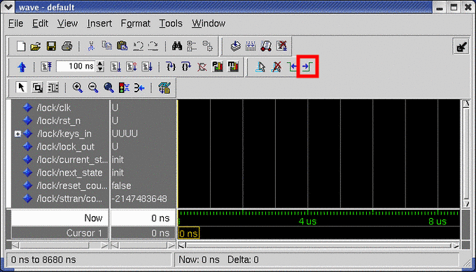
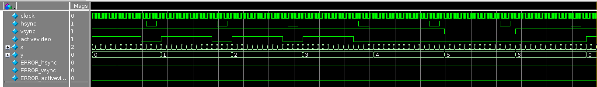
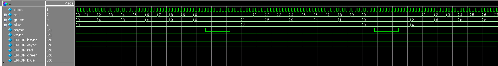
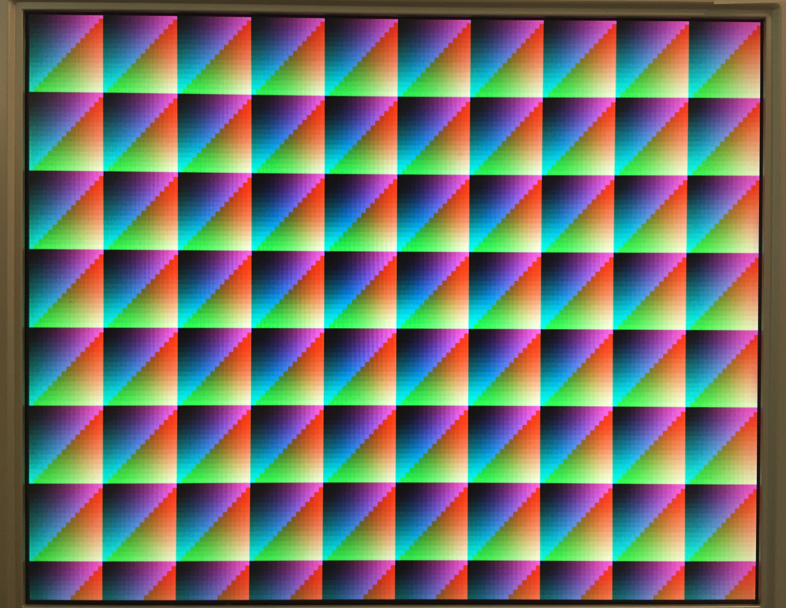
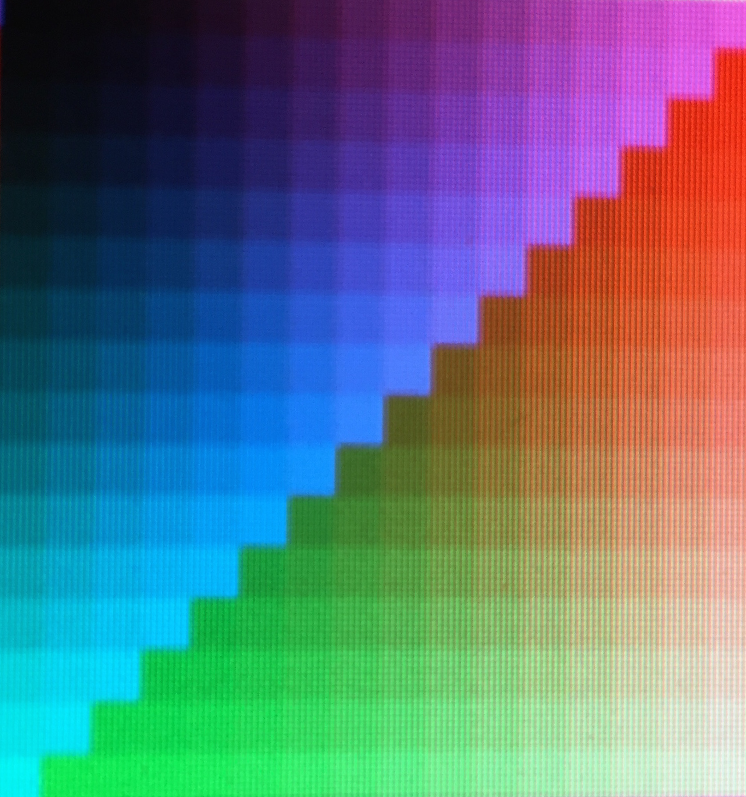

# Laboratório 4: Gerador de Sincronismo VGA

Este laboratório é mais uma das atividades de instrumentação na plataforma de desenvolvimento DE2-115. O roteiro consiste de três etapas, cada qual construída com base na anterior.

Ao longo desta prática você irá aprender a:

- Projetar contadores para contarem à uma fração (em potência de 2) da frequência do clock.
- Entender com monitores padrão VGA funcionam.
- Produzir sinais de temporização para alimentar um monitor padrão VGA (utilizando um contador-xy 2-D).
- Entender como os valores de cor são codificados.
- Entender como o comandos `parameter` e `define` são usados em Verilog para especificar parâmetros e valores constantes.

Neste roteiro prático, você irá projetar uma interface para controle padrão para um monitor VGA.

## Projetando um Circuitos Gerador de Sincronismo VGA

> 🙇‍♂️ Estude a especificação de tempo do VGA presente no manual da placa, localizado na seção 4.10 (pág 51--53). Aproveite para analisar as tabelas contendo as especificações de temporização para os diferentes padrões VGA cujo link foi disponibilizado no site do curso.

Utilize o modelo fornecido para projetar um temporizador VGA, responsável por produzir os sinais de sincronizações de vídeo. Primeiro vamos projetar um "_toy display_" que possui apenas 10 colunas e 4 linhas. As especificações para essa parte são apresentadas no arquivo de cabeçalho `display10x4.svh`.

- Compreenda o uso do comando `include` para incluir outro arquivo fonte.
- Arquivos como `display10x4.svh`, usados para fornecer parâmetros para seu projeto, são também chamados de arquivos de "cabeçalho Verilog" e, geralmente, são nomeados com a extensão `.svh`. O Quartus Prime é capaz de localizar esses arquivos, uma vez que eles sejam declarados dentro dos módulos do projeto e que estejam dentro do diretório de arquivos fonte.
- Entenda como podemos usar do comando `define` para estabelecer as substituições textuais. O lado direito de um `define` realiza a substituição literal do texto pelo valor definido (da mesma forma que um comando localizar-e-substituir!).

Um código de exemplo para o módulo de sincronismo VGA (`vgasynctimer`) foi fornecido junto com os arquivos de laboratório e uma transcrição do código é apresentada a seguir:

```systemverilog
`timescale 1ns / 1ps
`default_net_type none
`include "display10x4.svh"

module vgasynctimer (
	input  wire clock,
	output wire hsync, vsync, activevideo,
	output wire [`xbits-1:0] x,
	output wire [`ybits-1:0] y
);

	// As linhas abaixo possibilitam contar a cada 2 ciclos de clock
	// Isso acontece porque, dependendo da resolução escolhida, você pode
	// precisar contar a 50 MHz ou 25 MHz.

	logic [1:0] clock_count = 0;
	always @(posedge clock) begin
		clock_count <= clock_count + 2'b01;
	end

	wire Every2ndTick = (clock_count[0] == 1'b1);

	// Esta parte instancia um xy-counter usando o contador de clock adequado
	// xycounter #(`WholeLine, `WholeFrame)
	//		xy (clock, 1'b1, x, y); // Conta em 50 MHz
	xycounter #(`WholeLine, `WholeFrame)
		xy (clock, Every2ndTick, x, y); // Conta em 25 MHz

   // Produz os sinais de sincronismo do monitor
   assign activevideo	= /* Coloque sua atribuicao aqui */
   assign hsync 			= /* Coloque sua atribuicao aqui */
   assign vsync 			= /* Coloque sua atribuicao aqui */

endmodule
```

Utilize o _test bench_ fornecido junto com os arquivos de laboratório (`vgasynctimer10x4_tb.sv`) para testar o seu circuito de temporização VGA.

> ⚠️ Observe, cuidadosamente, os tempos de início e fim dos pulsos `hsync` e `activevideo` em relação aos valores de `x` do contador, e certifique-se de que você não produziu um erro de decremento de um. Ou seja, o valor do contador está zerando um ciclo de clock antes do esperado.

O _test bench_ fornecido neste procedimento é "auto-verificável", com as saídas esperadas embutidas dentro dele! Entretanto, diferente dos roteiros anteriores, uma falha só poderá ser identificada na janela de _waveform_.

> 🎯 Se um ERRO\* acontecer, o sinal ficará vermelho.

Agora vamos tentar localizar o pulso de sincronismo vertical. Para isso, clique no sinal `vsync` (selecionando a coluna do nome, e clicando na forma de onda), e então clique no ícone **Next transition** (indicado na Figura abaixo) localizado na barra de ferramentas do ModelSim. Esse botão fará com que o cursor se mova para o início do próximo pulso de sincronismo vertical.



Você pode clicar novamente até encontrar o último pulso. Você pode também clicar no botão **Previous transition** para navegar até os pulsos iniciais.

Utilize os botões de **Zoom in** e **Zoom out** do ModelSim para visualizar os pulsos verticais dentro da janela. A forma de onda deve aparecer exatamente como na imagem a seguir.



Observe com cuidado os tempos de início de fim dos pulsos de `hsync`, `vsync` e `activevideo` em relação aos contadores `x` e `y`, e certifique-se de que não haja nenhum erro!

> ⚠️ Se algum erro for identificado, um dos sinais com ERRO\* ficará vermelho no intervalo de tempo onde sua simulação falhou.

## Alimentando o Monitor de Vídeo

Agora vamos usar o gerador de pulsos de sincronismo VGA, e alimentar um monitor de vídeo com alguma informação de cor.

> 💁 Infelizmente, como nós ainda não temos nada muito legal para mostrar, então vamos exibir uma sequência aleatória de cores, em um padrão que seja fácil de reconhecer, se for exibido corretamente.

Um modelo em SystemVerilog para o módulo `vgadriver` foi fornecido para você juntamente com os arquivos de laboratório e foi copiado a seguir, somente por conveniência.

```systemverilog
`timescale 1ns / 1ps
`default_net_type none
`include "display10x4.svh"

module vgadriver(
    input  wire clock,
    output wire [3:0] red, green, blue,
    output wire hsync, vsync, avideo
    );

   wire [`xbits-1:0] x;
   wire [`ybits-1:0] y;
   wire activevideo;

   assign avideo = activevideo;

   vgasynctimer my_vgatimer (clock, hsync, vsync, activevideo, x, y);

   assign red[3:0]   = (activevideo == 1) ?  x[3:0] : 4'b0;
   assign green[3:0] = (activevideo == 1) ? {x[2:1],y[1:0]} : 4'b0;
   assign blue[3:0]  = (activevideo == 1) ? {y[2:0],1'b0} : 4'b0;

endmodule
```

Simule o circuito usando o _test bench_ fornecido junto com os arquivos de laboratório (vgadriver10x4_tb.sv}). Verifique se a simulação é apresentada exatamente como esperado, em consonância com os valores presentes no arquivo `display10x4.svh`.

Ao final da simulação, você deve visualizar uma saída da janela de forma de onda exatamente igual àquela apresentada na figura a seguir (para uma simulação de duração igual a 4 nanosegundos).



Caso seu controlador não esteja exibindo os resultados **exatamente** como apresentado na figura acima, não siga adiante. Um erro de contagem pode facilmente provocar um atraso na sincronização entre os circuito e o monitor.

> ⚠️ Novamente, se algum erro for identificado, um dos sinais com ERRO\* ficará vermelho no intervalo de tempo onde o erro foi identificado.

## Mostre um Padrão mais Interessante em um Monitor de Verdade

Uma vez que o seu controlador para o "_toy display_" `10 x 4` estiver funcionando corretamente, selecione um conjunto real de valores de temporização modificando o arquivo de cabeçalho para `display640x480.svh` tanto no arquivo `vgasynctimer.sv` quanto em `vgadriver.sv`.

Crie um novo projeto no Quartus Prime, definindo como _top level_ o módulo `de2_115top`. Esse módulo já instancia o controlador VGA e realiza a conversão dos valores de cor de 4-bits para 8-bits, de acordo com o padrão do controlador da placa.

Programe o projeto na placa, conecte o monitor VGA e verifique se tudo está funcionando. Se tudo der certo, você deve visualizar um padrão de cores no monitor.

Sua tarefa agora é modificar as três linhas responsáveis por produzir os valores RGB no alimentador (`vgadriver`), de modo a apresentar o padrão representado na figura a seguir.

<!--  -->


Cada "caixa" é apresentada na forma de um padrão de `64 x 64` pixels. Dentro de cada caixa, o valor de `red` aumenta de 0 até 15, da esquerda para a direita, incrementando a cada quatro pixeis; da mesma forma, o valor de `green` aumenta de 0 até 15, de cima para baixo, incrementado a cada quatro pixels. Finalmente, o valor de `blue` aumenta no sentido diagonal, da região superior esquerda, até a inferior direita, de 0 até 15, incrementado a cada quatro pixeis **duas vezes** (a primeira da região superior esquerda até o meio, e então novamente do meio até a região inferior direita).

> 💁 **Atenção para a dica:** Apesar de parecer complicado, essa é uma tarefa muito simples! Não gaste muito tempo pensando nela! Não se preocupe com a proporção, visto que trabalharemos com monitores com resoluções proporcionais a `16 x 10`.

A seguir uma figura destaca apenas uma caixa de `64 x 64` pixeis.

<!--  -->


As figuras a seguir apresentam um destaque para a representação final que cada componente de cor deve apresentar. Você pode usar essa referência para exibir apenas uma cor de cada vez no monitor, validando assim a funcionalidade da sua lógica.

<!-- 

 -->

<p float="left">
  
   
  
</p>

## Acompanhamento (entrega: sexta-feira 20 de maio, 2022)

Durante a aula esteja pronto para apresentar para o professor ou monitor:

- Os arquivos referentes à [última parte do roteiro](#mostre-um-padrão-mais-interessante-em-um-monitor-de-verdade): `xycounter.sv`, `vgasynctimer.sv`, e `vgadriver.sv`.
- Uma demonstração do funcionamento do seu circuito final, exibindo os padrões em um monitor VGA.

## Agradecimentos

Este laboratório é o resultado do trabalho de docentes e monitores de GCET231 ao longo dos anos, incluindo:

- **18.1:** Caio França dos Santos
- **18.2:** Matheus Rosa Pithon
- **20.2:** Matheus Rosa Pithon
- **21.1:** Matheus Rosa Pithon, Éverton Gomes dos Santos
- **21.2:** Éverton Gomes dos Santos
