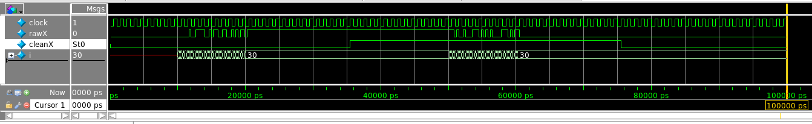
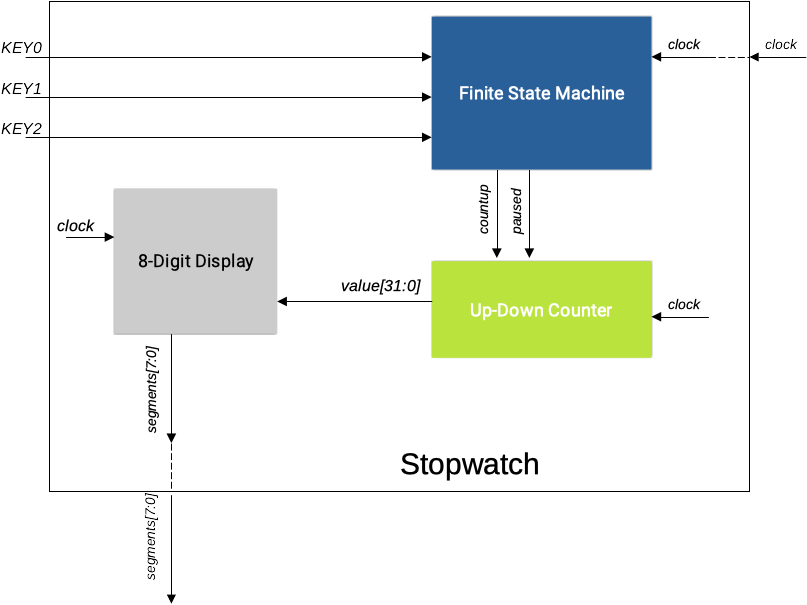
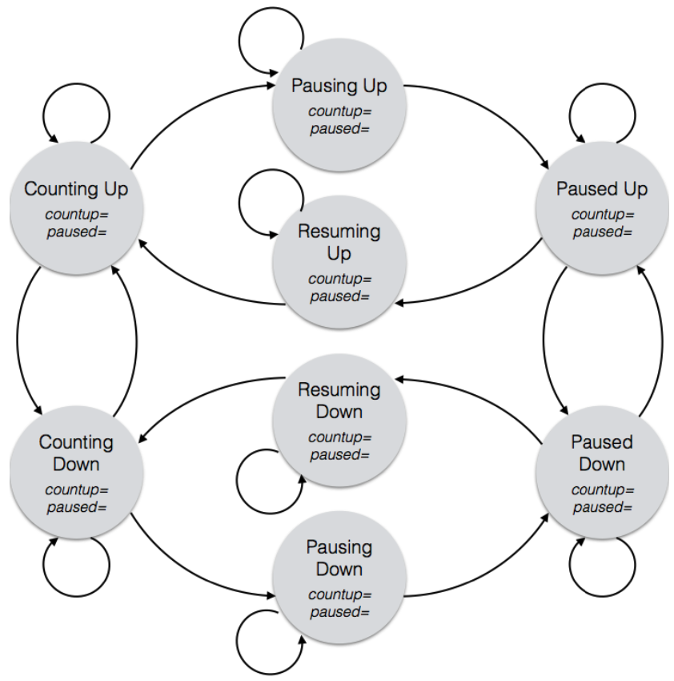

# Laboratório 6: Cronômetro

Prof. João Carlos Bittencourt

Monitor: Éverton Gomes dos Santos

Centro de Ciências Exatas e Tecnológicas

Universidade Federal do Recôncavo da Bahia, Cruz das Almas

## Introdução

Ao longo desta prática você irá aprender a:

- Filtrar chaves de entrada utilizando um circuito _debouncing_.
- Desenvolver um cronômetro progressivo-regressivo.
- Escrever lógica combinacional usando atribuição não contínua.

## Identificação do Efeito Bouncing

Nesta parte, vamos analisar o efeito causado por contatos mecânicos e chaves, conhecido como _bounce_. Nós iremos fazer alguns testes com as chaves (por enquanto, apenas a chave mais à direita), e analisar quantas vezes sua saída comuta cada vez que você desloca a chave.

Nossa estratégia consiste em reutilizar o circuito do Lab 5 (`counterNdigit`), mas no lugar de incrementar o contador a cada borda positiva do clock, faça com que o contador incremente a cada borda positiva da chave de entrada. Dessa forma, cada vez que a chave se movimentar (ou seja, para cima e para baixo novamente), o contador irá contar como um deslocamento.

> Apenas o contador será alimentado pela chave de entrada como "clock"; o resto do circuito deve continuar a ser alimentado pelo clock real.

Analise, no arquivo `seebounce.sv`, como o contador (chamado `numBounces`) conta as transições das bordas de subida de `X`, que representa a entrada da chave rotulada como `SW[0]`.

Execute as ferramentas e programe a placa. Movimente a chave para cima e para baixo algumas vezes, e observe o que acontece. É possível que algumas vezes você não perceba o _bounce_ -- as chaves da DE2-115 foram projetadas para minimizar esse efeito! Certamente, você será capaz de observar se movimentar a chave um pouco devagar.

## Corrigindo o Efeito Bounce

Agora vamos corrigir o efeito provocado pelos contatos da chave e produzir um sinal de transição limpo. Para isso, vamos introduzir um novo módulo chamado `debouncer` entre a entrada e onde deseja-se que ela seja utilizada. Vamos utilizar a seguinte estratégia:

> Quando uma entrada para o `debouncer` muda seu valor em relação ao valor atual da saída do `debouncer`, espere por uma certa quantidade de tempo (tipicamente alguns milisegundos) e verifique se a entrada permaneceu estável ao longo desse tempo antes de alternar a nova saída do `debouncer`.}

Utilize o código fornecido para construir o `debouncer` e faça o que se pede:

- Algumas linhas do código foram omitidas de propósito. Preencha as partes que faltam.
- O parâmetro `N` determina a duração do _debouncing_. Especificamente, o circuito irá verificar se a entrada permaneceu estável por 2ˆN ciclos de clock consecutivos antes de reagir a ele. Se você definir uma valor muito pequeno para `N` (digamos `N=2`, resultando em 4 ciclos de clock), ele pode não ser capaz de filtrar o sinal completamente. Se você definir um `N` muito grande (tente `N=32`), o _debouncing_ irá demorar muito.
- Utilize o teste fornecido `debounce_tb.sv` para testar o seu circuito. O testador define `N=4`, o que é um valor muito pequeno, mas adequado para testar o funcionamento do _debouncer_ em um ambiente de simulação. Se sua simulação resultar nas formas de onda descritas na figura a seguir, então seu circuito estará funcionando corretamente e você poderá seguir para a próxima etapa.

- Instancie um módulo `debouncer` dentro do arquivo `seebounce.sv`, para limpar qualquer ruído da entrada `X`. Ou seja, passe `X` como entrada do _debouncer_ e utilize a saída "limpa" do _debouncer_, aqui chamada de `cleanX`, como o clock para incrementar `numBounces` (ou seja, utilize `posedge cleanX`, no lugar de `posedge X`). Calcule o valor de `N` que faça com que a duração do _debouncer_ seja igual a, aproximadamente, 10 ms. Utilize este valor para o resto do laboratório. Agora, quando você movimentar a chave repetidamente, não deve mais perceber o efeito _bounce_.

### Responda

> Qual foi o valor de `N` que você calculou para que o _debounce_ dure 10 ms?

## Projete um Cronômetro de 8 Dígitos Hexadecimais

Sua tarefa final é adicionar as funcionalidades a seguir para o seu contador de 8 dígitos (`counterNdigit` do Lab 5):

1. Contar de forma crescente ou decrescente;
2. Parar e iniciar (pausar e recomeçar).

Seu projeto final deve atender aos requisitos a seguir:

- Use os _push-buttons_ no lugar das chaves: `KEY0` para contagem crescente, `KEY1` para contagem decrescente, `KEY2` para interromper e retomar.
- Use três instâncias do módulo `debouncer` para corrigir qualquer efeito de _bouncing_ em cada um dos três botões de entrada.
- O contador começa em 0 em uma contagem ascendente. Se o contador estiver incrementando e chegar em `FFFFFFFF`, ele simplesmente retorna para `00000000` e continua a contar. De forma similar, se o contador estiver em contagem decrescente e chegar em `00000000`, o mesmo retornará para `FFFFFFFF` e continuar a contagem normalmente.

> Nenhuma dessas funcionalidades requer um circuito especial; a especificação acima representa exatamente como um circuito contator se comparta ao atingir o limite de contagem.

- O dígito menos significativo deve contar à uma taxa de _aproximadamente_ **256 vezes por segundo**.

O comportamento esperado para o circuito é descrito a seguir em mais detalhes:

- O contador inicia em 0, e começa a contagem crescente.
- Se, a qualquer momento, o botão `KEY1` for pressionado, o contador alterna seu modo contagem para decrescente. Da mesma forma, se, a qualquer momento, o botão `KEY1` for pressionado, o contador alterna seu modo de contagem para crescente (pressionar o botão crescente enquanto o contador já estiver no modo crescente não produzirá efeito algum; assim como deve acontecer no modo decrescente).
- Se o contador estiver em contagem (crescente ou decrescente), e o botão `KEY2` for pressionado, o contador interrompe a contagem e mantém o valor atual. Em seguida, o mesmo botão deve ser pressionado novamente para que a contagem seja retomada.
- Quando a contagem estiver interrompida, a direção da contagem (crescente ou decrescente) é mantida, de modo que, na retomada, o contador continue na mesma direção. Entretanto, durante a pausa, a direção do contador pode ser modificada, se os botões `KEY0` e `KEY1` forem pressionados.
- Em resumo, o botão `KEY2` alterna entre contagem e interrupção, enquanto os botões `KEY0` e `KEY1` alteram a direção da contagem.

Para acompanhar todos os estados do sistema você precisará de uma máquina de estados finitos (FSM). A figura a seguir apresenta um diagrama que descreve a hierarquia deste circuito.

> Garanta que sua especificação coincida exatamente com diagrama apresentado.

Certifique-se que o seu projeto contenha os módulos a seguir em seus arquivos:

- Display de 8 dígitos: `displayNdigit.sv`
- Debouncer: `debouncer.sv`
- Máquina de Estados Finitos: `fsm.sv`
- Contador Up-Down BCD: `updowncounter.sv`
- Módulo _top level_ do cronômetro (tudo deve estar dentro dele): `stopwatch.sv`

Para ajudar a implementar sua FSM, um diagrama de transição de transição de estados é apresentado a seguir. Você precisará preencher os detalhes como discutido em sala/laboratório.

Você deve rotular as entradas sob os arcos e as saídas dentro dos estados (máquina de estados de Moore). Siga o passo-à-passo usual para converter o seu diagrama de estados em um código Verilog (utilize o modelo fornecido no arquivo `lab6_fsm_template.sv`).

> Consulte também o tutorial sobre [Máquinas de Estados Finitos em Verilog](https://gcet231.github.io/#/recursos/fsm) disponível no site do curso.

## Acompanhamento (entrega: sexta-feira 03 de junho, 2022)

Durante a aula esteja pronto para apresentar para o professor ou monitor:

- Os arquivos do laboratório `debouncer.sv`, `fsm.sv`, `updowncounter.sv`, e `stopwatch.sv`.
- Uma demonstração do seu circuito demonstrando o funcionamento do cronômetro.

## Agradecimentos

Este laboratório é o resultado do trabalho de docentes e monitores de GCET231 ao longo dos anos, incluindo:

- **18.1:** Caio França dos Santos
- **18.2:** Matheus Rosa Pithon
- **20.2:** Matheus Rosa Pithon
- **21.1:** Matheus Rosa Pithon, Éverton Gomes dos Santos
- **21.2:** Éverton Gomes dos Santos