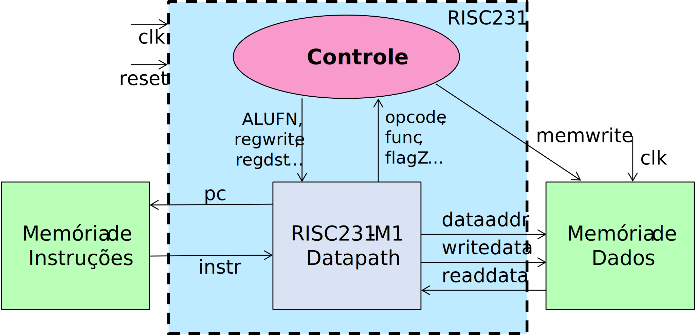
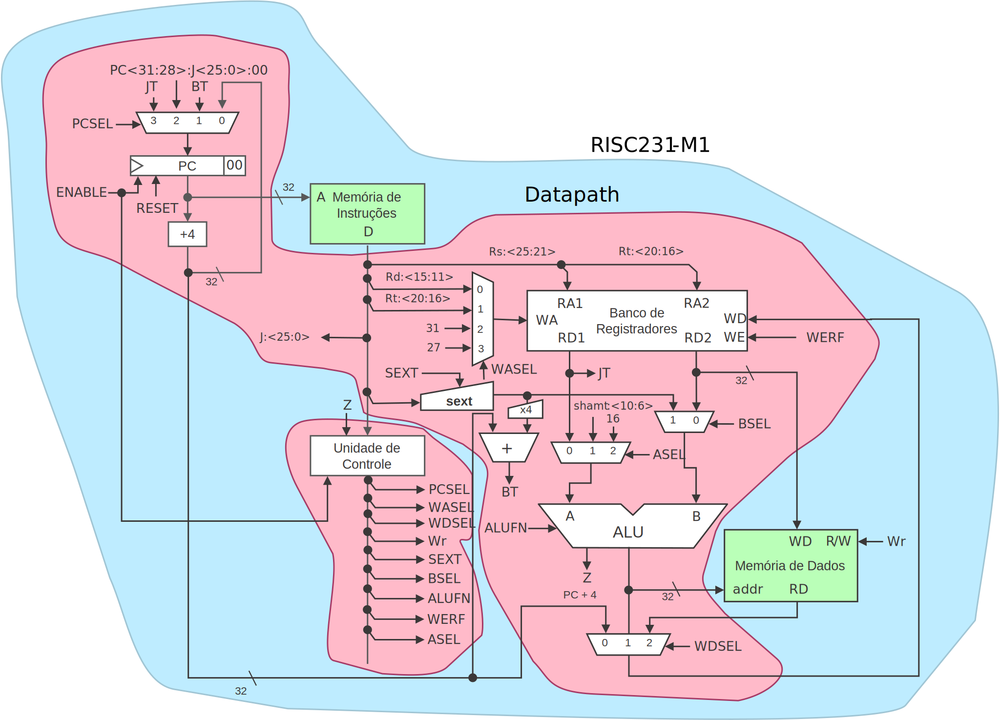
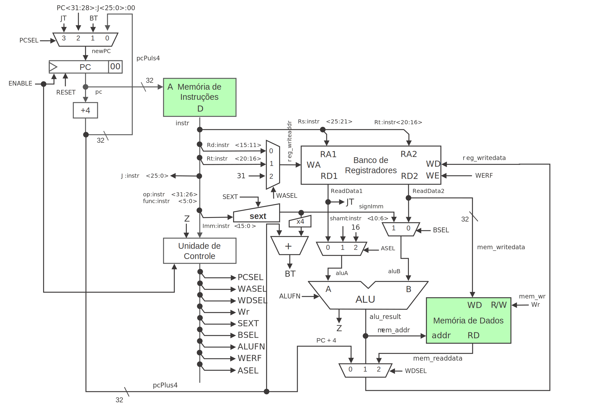

# Lab 8: Um Processador Monociclo Completo

Prof. João Carlos Bittencourt

Monitor: Éverton Gomes dos Santos

Centro de Ciências Exatas e Tecnológicas

Universidade Federal do Recôncavo da Bahia, Cruz das Almas

## Introdução

Ao longo deste roteiro de laboratório você irá aprender a:

- Integrar ALU, registradores, etc., para formar um caminho de dados completo.
- Projetar a unidade de controle de um processador MIPS.
- Integrar a unidade de controle ao caminho de dados.
- Integrar unidades de memória a um processador.
- Codificar um conjunto de instruções.
- Mais práticas com rotinas de teste para verificação de um processador.

## Revise os Slides de Aula: Projeto do Processador RISC231-M1

Estude os slides de aula cuidadosamente, e revise os Capítulos 7.1--7.3 do [livro do David e Sarah Harris](https://www.google.com.br/books/edition/Digital_Design_and_Computer_Architecture/SksiEAAAQBAJ?hl=pt-BR&gbpv=0). Revise também o [folheto verde](https://gcet231.github.io/#/recursos/MIPS_Green_Sheet.pdf) do livro Patterson & Hennessy contendo o conjunto de instruções do processador MIPS.

> 🎯 Uma versão PDF deste folheto pode ser acessada [aqui](https://gcet231.github.io/#/recursos/MIPS_Green_Sheet.pdf).

Apesar de haverem diferenças entre os livros de autoria de Patterson & Hennessy e o livro texto Harris Harris, nós utilizaremos o primeiro. Faremos isso por que o [simulador MARS](http://courses.missouristate.edu/kenvollmar/mars/), que você utilizará para construir seu código assembly, segue o livro do Patterson & Hennessy.

Estude os Slides para identificar as decisões de projeto específicas para versão do processador utilizada em nosso laboratório:

- **Exceções:** Nossa versão do RISC231 não possui suporte a exceções.
- **Reset:** Nosso processador possui suporte a sinal de reset. Mais especificamente, se a entrada `reset` for acionada, o contador de programas (_program counter_) é reiniciado para o endereço `0x0040_0000`. Este endereço foi escolhido tendo em vista compatibilizá-lo com o assembler MARS. Desta forma, o registrador PC, presente no _data path_, deve ser inicializado neste endereço, e reiniciado sempre que o `reset` for acionado.
- **Enable:** Para auxiliar no processo de depuração, nós vamos incorporar um sinal de entrada `enable`. Quando ativo, o processador executa normalmente as instruções. Entretanto, quando `enable == 0`, o processador "congela". Esse procedimento é realizado desativando a escrita nos seguintes componentes: _program counter_, _register file_ e _memória de dados_. Essa modificação permitirá executar nossos programas passo-a-passo, auxiliando assim no processo de depuração.

## A Unidade de Controle

Para preparar o projeto de um processador MIPS, nós iniciaremos com o desenvolvimento da unidade de controle. A seguir são apresentados dois diagramas no nosso processador MIPS _single-cycle_, primeiro com uma visão de alto nível, e em seguida uma versão mais detalhada.

A seguir apresentamos uma visão mais detalhada.

Primeiro vamos desenvolver a unidade de controle. Ela deve dar suporte a **TODAS** as instruções apresentadas a seguir:

- Load (`lw`) e store (`sw`)
- Instruções do Tipo-I: `addi`, `addiu`, `slti`, `sltiu`, `ori`, `lui`, `andi`, `xori`}
  - ⚠️ Diferente do que você possa ter aprendido, `addiu`, na verdade, não realiza uma soma sem sinal (_unsigned_). Na verdade, ela estende o sinal do imediato (replica o bit mais significativo até completar os 32 bits). A única diferença entre `addi` e `addiu` é que a instrução `addiu` não causa uma exceção na ocorrência de um _overflow_, enquanto que a `addi` sim. Como não estamos implementando exceções no nosso processador, `addiu` e `addi` são idênticas para nossos propósitos.
  - ⚠️ Também diferente do que você possa ter aprendido, a instrução `sltiu`, na verdade, também estende o sinal do imediato, _mas realiza uma comparação sem sinal_. Ou seja, a operação definida por `ALUFN` é `LTU`.
  - Note ainda que a instrução `ori` deve estender zero a partir do imediato (completar a palavra com zeros), por se tratar de uma operação lógica! Finalmente, a extensão do sinal para a instrução `lui` é um _don't-care_, uma vez que o imediato de 16-bits é posicionado na parte mais significativa do registrador.
- Instruções do Tipo-R: `add, addu, sub, and, or, xor, nor, slt, sltu, sll, sllv, srl` e `sra`
  - Para nossos propósitos, a instrução `addu` é _semelhante_ à instrução `add`. A diferença está apenas na foma como elas lidam com o _overflow_ -- situação que será ignorada no nosso projeto. A razão para darmos suporte à instrução `addu` é que o assembler MARS geralmente introduz automaticamente instruções `addu` no nosso código, especialmente para a faixa de endereços de memória que nós estamos usando.
- Instruções do Tipo-J e saltos condicionais (_branches_ - Tipo-I): `beq, bne, j, jal` e `jr`.

Estude os slides de aula sobre o processador RISC231 mono-ciclo. Em seguida preencha a Tabela abaixo com os valores de todos os sinais de controle para as 28 instruções RISC listadas aqui. Se o valor de um sinal de controle não importa para uma dada instrução, você poderá usar o símbolo de _don't care_ (`1'bx`, `2'bx`, etc., dependendo da quantidade de bits).

> 💁 A partir dos valores da Tabela, complete o código Verilog da unidade de controle no arquivo [`controler.sv`](../src/controller.sv), disponibilizado junto com os arquivos de laboratório.

Utilize o _test bench_ fornecido para simular e validar o seu projeto. Assim como nos roteiros anteriores, esse _test bench_ é auto-verificável, de modo que, se algum erro for identificado, ele será sinalizado no _waveform_ do simulador.

> ⚠️ Certifique-se de utilizar os mesmos nomes, presentes no teste, para as entradas e saídas do _top-level_.

|  Type  | Instr | werf | wdsel | wasel | asel | bsel | sext | wr  | alufn |   pcsel    |
| :----: | :---: | :--: | :---: | :---: | :--: | :--: | :--: | :-: | :---: | :--------: |
| I-Type |  LW   |  1   |  10   |  01   |  00  |  1   |  1   |  0  | 0XX01 |            |
|        |  SW   |      |       |       |      |      |      |     |       |            |
|        | ADDI  |      |       |       |      |      |      |     |       |            |
|        | ADDIU |      |       |       |      |      |      |     |       |            |
|        | SLTI  |      |       |       |      |      |      |     |       |            |
|        | SLTIU |      |       |       |      |      |      |     |       |            |
|        |  ORI  |      |       |       |      |      |      |     |       |            |
|        |  LUI  |      |       |       |      |      |      |     |       |            |
|        | ANDI  |      |       |       |      |      |      |     |       |            |
|        | XORI  |      |       |       |      |      |      |     |       |            |
|        |  BEQ  |      |       |       |      |      |      |     |       | Z=1 \| Z=0 |
|        |  BNE  |      |       |       |      |      |      |     |       | Z=1 \| Z=0 |
| J-Type |   J   |      |       |       |      |      |      |     |       |            |
|        |  JAL  |      |       |       |      |      |      |     |       |            |
| R-Type |  ADD  |      |       |       |      |      |      |     |       |            |
|        | ADDU  |      |       |       |      |      |      |     |       |            |
|        |  SUB  |      |       |       |      |      |      |     |       |            |
|        |  AND  |      |       |       |      |      |      |     |       |            |
|        |  OR   |      |       |       |      |      |      |     |       |            |
|        |  XOR  |      |       |       |      |      |      |     |       |            |
|        |  NOR  |      |       |       |      |      |      |     |       |            |
|        |  SLT  |      |       |       |      |      |      |     |       |            |
|        | SLTU  |      |       |       |      |      |      |     |       |            |
|        |  SLL  |      |       |       |      |      |      |     |       |            |
|        | SLLV  |      |       |       |      |      |      |     |       |            |
|        |  SRL  |      |       |       |      |      |      |     |       |            |
|        |  SRA  |      |       |       |      |      |      |     |       |            |
|        |  JR   |      |       |       |      |      |      |     |       |            |

## Projete o processador RISC231 Monociclo

Junte todas as partes do diagrama do caminho de dados para criar um processador RISC mono-ciclo tal qual discutido em aula. Os códigos Verilog para alguns dos módulos foram disponibilizados junto com os arquivos de laboratório. De forma mais específica, você deverá realizar as tarefas elencadas a seguir.

**Descreva o processador RISC231-M1, juntamente com as memórias de instruções e dados**, como apresentado em aula. Comece com o arquivo [`top.sv`](../src/top.sv), o qual já apresenta o módulo _top-level_ em Verilog. Entenda como ele está em conformidade com o diagrama de blocos apresentado no início do roteiro, e tome nota de todos os parâmetros.

Por enquanto, vamos escolher um tamanho relativamente pequeno para cada memória, por exemplo, 128 posições de memória para a memória de instruções e 64 para a memória de dados.

> 💁 Os endereços produzidos pelo processador para acessar as memórias ainda continuarão sendo de 32 bits, mesmo que sejam utilizados menos bits de endereço. Use os módulos ROM e RAM fornecidos ([`rom_module.sv`](../src/rom_module.sv) e [`ram_module.sv`](../src/ram_module.sv)), e observe o seguinte:

- A memória de instruções será uma ROM, enquanto a memória de dados será uma RAM. Nós iremos instanciar os módulos ROM e RAM (sem modificar duas descrições Verilog), e fornecer os parâmetros apropriados, os quais, por sua vez, são definidos no módulo _top-level_ de teste. (Ver `top.sv`).
- Nós vamos enviar todos os 32 bits do contador de programas (`PC`) para fora do processador e conectá-lo à memória de instruções, mas eliminaremos os dois bits menos significativos na interface, de modo que _apenas uma palavra de endereço de 30 bits_ seja enviada para dentro da memória de instruções. Isso irá converter um endereço de byte para um endereço de palavra. (Ver `top.sv`).
- Da mesma maneira, vamos enviar todos os 32 bits de endereço da memória de dados para fora do processador, mas cortar os dois bits menos significativos da interface. Desse modo, _apenas uma palavra de endereço de 30 bits_ é de fato enviada para a memória de dados (veja `top.sv`).
- Ambas as memórias devem retornar uma palavra de 32 bits (`Dbits = 32`). Seus valores iniciais são lidos a partir do `initfile`, o qual corresponde ao nome do arquivo de inicialização da memória.

Inicialize as memórias de instruções e dados utilizando o método apresentado no [Lab 7](../../lab7/spec/spec.md). O arquivo que possui os valores iniciais para a memória de instruções conterá uma instrução codificada de 32 bits por linha (em hexadecimal). O arquivo que com os valores iniciais para a memória de dados também terá apenas valores de dados de 32 bits a cada linha.

> 💁 Você pode criar estes arquivos dentro do próprio Quartus Prime, ou utilizando seu editor de textos preferido.

- O módulo do processador, contendo os blocos controlador e _data path_, foi fornecido no arquivo [`risc231-m1.sv`](../src/risc231_m1.sv). Entenda como ele se espelha no diagrama de blocos apresentado a seguir.

> ✅ Observe que não há diferenças entre o projeto do MIPS do livro de Harris e Harris e o que nós estamos desenvolvendo neste roteiro. Entretanto, o nosso processador possui uma versão muito mais sofisticada de ALU. Portanto, não siga de forma irrestrita as informações presentes no livro; ao invés disso, siga os slides de aula e anotações dos laboratórios. O caminho de dados deve ser de 32 bits (registradores, ALU, memória de dados e memória de instruções, usam palavras de 32 bits).

- Complete todas as pequenas peças do caminho de dados, de modo que o projeto se pareça com aquele apresentado na aula, também reproduzido a seguir. Pequenos conjuntos de código podem ser "aninhados" (no lugar de escritos em módulos separados), por exemplo, multiplexadores, extensor de sinal, somadores, deslocamento-por-2, etc.

As figuras apresentada na seção [A Unidade de Controle](#a-unidade-de-controle) apresentam uma decomposição hierárquica do projeto _top-level_. Atente-se que o seu projeto deve seguir **exatamente** essa hierarquia.

Outras dicas que podem te ajudar durante os testes:

- Lembre-se de usar a diretiva `default_nettype none` para facilitar a captura de declarações ausentes ou incompatibilidades de nomes devido a erros de digitação, etc.
- É altamente recomendável que você conecte entradas/saídas pelo nome, especialmente para módulos que contenham muitas entradas/saídas. Caso contrário, é fácil desalinhar as portas, causando dores de cabeça durante a depuração. Você pode seguir o estilo presente em [`risc231-m1.sv`](../src/risc231_m1.sv) para as conexões do controlador e do caminho de dados.
- Use o _test bench_ para testar seu processador por meio de simulação. Um testador de autoverificação foi fornecido junto com os arquivos do laboratório. Ele fpo elaborado primeiro escrevendo o código em linguagem de montagem MIPS, depois compilando esse código usando MARS. Por fim, as instruções foram convertidas em código de máquina hexadecimal, que deve ser usado para inicializar sua memória de instrução. Armazene o código da máquina no arquivo usado para inicializar a memória de instruções. Certifique-se de inicializar o contador de programas (PC) dentro do seu processador para `0x0040_0000`, para que ele comece a ser executado desde o início da memória de instruções. Da mesma forma, para inicializar sua memória de dados, coloque os valores iniciais no arquivo correspondente.
  - O testador é chamado de full ([`risc231_m1_tb.sv`](../sim/tb/risc231_tb.sv)). O programa de montagem ([`full.asm`](../app/full.asm)) executa cada uma das 28 instruções que implementamos, incluindo chamadas/retornos de procedimento e recursão usando uma pilha. Você não precisa executar este programa no MARS, mas pode se desejar. Ao todo são 59 instruções, então a memória de instruções deve ter pelo menos essa quantidade de posições. O testador define o parâmetro `Nloc` para memória de instrução como `64`. Além disso, no _test bench_, certifique-se de especificar os nomes corretos dos arquivos que possuem valores de inicialização ([`full_imem.mem`](../sim/tests/full_imem.mem) e [`full_dmem.mem`](../sim/tests/full_dmem.mem), respectivamente).
- Por enquanto, você não vai implementar esse projeto na placa. Você fará isso no projeto final.

## Acompanhamento

### Parte 1: Unidade de Controle (entrega: sexta-feira 08 de julho, 2022)

Durante a aula esteja pronto para apresentar para o professor ou monitor:

- O arquivo Verilog: `controller.sv`.
- A simulação para a [Unidade de Controle](#a-unidade-de-controle), utilizando o [_test bench_](../sim/tb/controller_tb.sv) fornecido junto com os arquivos de laboratório.

### Parte 2: Processador RISC231 Monociclo (entrega: sexta-feira 15 de julho, 2022)

ALL of the Verilog files, but skip the ALU and its submodules. Also, the screenshot of the simulation waveforms for the “full” self-checking tester provided.

- **TODOS** os arquivos Verilog, com exceção a ALU e seus sub-módulos.
- Uma demonstração de funcionamento do seu processador RISC231 utilizando o [testador auto-verificável](../sim/tb/risc231_tb.sv) fornecido junto com os arquivos de laboratório.

## Agradecimentos

Esse roteiro é fruto do trabalho coletivo dos professores e monitores de GCET231:

- **18.1:** Caio França dos Santos
- **18.2:** Matheus Rosa Pithon
- **20.2:** Matheus Rosa Pithon
- **21.1:** Matheus Rosa Pithon, Éverton Gomes dos Santos
- **21.2:** Éverton Gomes dos Santos
